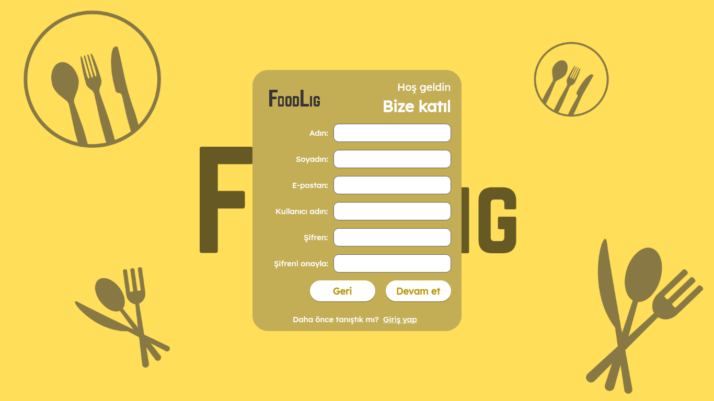
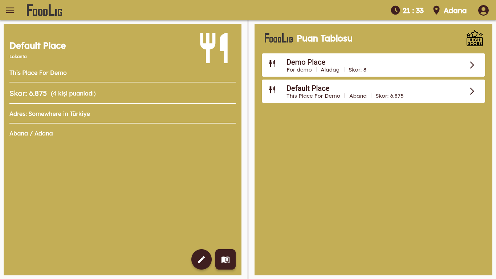

# Restaurant Rating App Web Frontend

<p align="center">
  
</p>

## Overview

Welcome to our Restaurant Rating App! This is part of our Software Engineering course project, where we created a web-based admin panel for restaurant managers. Here, managers can manage their restaurant details and check out other restaurants in the same city. I worked on the front end using Flutter.

## Features

- **Admin Panel**: Manage your restaurant details and explore other restaurants in your city.
- **UI Design**: I designed the UI to be user-friendly and responsive.
- **API Integration**: The app connects to an API for smooth data management.
- **Firebase Deployment**: The app is currently deployed on Firebase for easy access.

## Challenges Faced

- **Responsiveness**: Making sure the web app looks good on all devices was quite the challenge.
- **UI Design**: Crafting an appealing and functional UI took a lot of planning and effort.

## Installation

Want to run this project locally? Here’s how:

1. **Clone the repository**:
    ```sh
    git clone https://github.com/your-username/restaurant-rating-app-admin.git
    ```
2. **Navigate to the project directory**:
    ```sh
    cd restaurant-rating-app-admin
    ```
3. **Install dependencies**:
    ```sh
    flutter pub get
    ```
4. **Run the project**:
    ```sh
    flutter run -d chrome
    ```

## Usage

Once you have it up and running, you can access the admin panel through your web browser. The admin panel allows you to:

- View and manage your restaurant details.
- Check out other restaurants in your city.

## Contributing

I’m open to comments and suggestions to improve my coding skills. If you have any feedback or find any issues, feel free to open an issue or submit a pull request.

## Deployment

The project is currently deployed on Firebase. You can check out the live version [here](https://restaurant-rating-fronte-84130.web.app/#/).

## License

This project is licensed under the MIT License - see the [LICENSE](LICENSE) file for details.

## Contact

If you have any questions or feedback, don't hesitate to get in touch with me via [my mail](ozgurcansizz@outlook.com).

## Screenshots

<p align="center">
  
  <br>
  Login Page
</p>

<p align="center">
  
  <br>
  Register Page
</p>

<p align="center">
  
  <br>
  Admin Panel
</p>
